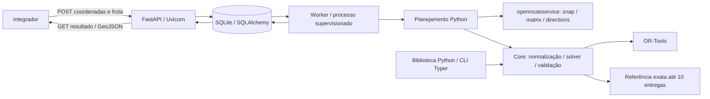

# Quantum Route Core

Serviço **API-first para planejamento de entregas**, com core Python reutilizável. Recebe um depósito, várias entregas com coordenadas/demandas e veículos com capacidades individuais; distribui as entregas, ordena as visitas e obtém trajetos pelas ruas.

**Status:** piloto clássico em validação. A integração ORS está implementada, mas a aceitação com chamadas reais e a implantação ainda precisam ser verificadas. Consulte [status e pendências](docs/status.md) e a [SPEC](specs/quantum-route-core-spec.md). QAOA é uma frente experimental ainda indisponível.

## Escopo inicial

- Até 15 entregas e 5 veículos por pedido, com limites configuráveis.
- Capacidades diferentes, um depósito comum e retorno ao depósito; cada entrega é atendida integralmente uma vez.
- Município de São Paulo, validado por polígono do IBGE; pontos na fronteira são aceitos.
- OR-Tools como resolvedor padrão, openrouteservice para custos viários e geometrias.
- API assíncrona com consulta/cancelamento de jobs; uso direto em Python e CLI auxiliar.
- Matriz explícita e coordenadas euclidianas como modos alternativos. Esses modos não produzem trajetos viários.

Trânsito em tempo real, geocodificação de endereços, janelas de atendimento, múltiplos depósitos e navegação curva a curva não fazem parte desta versão. A expansão para o estado de São Paulo é uma etapa posterior. Não há promessa de SLA ou de ótimo para a busca heurística.

## Arquitetura e stack



Python 3.12, Pydantic, FastAPI, Uvicorn, OR-Tools, SQLAlchemy, Alembic, HTTPX, Shapely e Typer. Dependências são fixadas no `uv.lock`. A biblioteca mínima depende somente de Pydantic; HTTP, banco e solvers opcionais são separados por extras.

## Instalação local

Requisitos: Python 3.12 e `uv`. Na raiz do repositório:

```powershell
uv run dev
```

Esse comando instala as dependências de desenvolvimento, prepara o banco e inicia a API e o worker no mesmo terminal. Abra **http://127.0.0.1:8000/docs** para enviar pedidos, consultar jobs e ver resultados. Pressione **Ctrl+C** para encerrar os dois serviços. Para outra porta, use `uv run dev --port 8080`.

O arquivo `.env` é opcional para iniciar. Para rotas pelas ruas, copie `.env.example` para `.env` se ainda não existir e configure `ORS_API_KEY`; reinicie o comando após alterações. Os modos `matrix` e `euclidean` podem ser usados imediatamente sem credencial. O comando não submete pedidos automaticamente.

### Inicialização manual (opcional)

Para executar os componentes separadamente:

```powershell
uv sync --frozen --extra service --extra classical --extra cli
Copy-Item .env.example .env
uv run alembic upgrade head
```

Configure `ORS_API_KEY` no arquivo `.env` para habilitar pedidos viários. Não coloque a chave no código nem nos pedidos HTTP. Os modos `matrix` e `euclidean` funcionam sem a chave.

Inicie a API e, em outro terminal, o worker:

```powershell
uv run uvicorn quantum_route_core.api.app:create_app --factory --host 127.0.0.1 --port 8000
```

```powershell
uv run qroute-worker
```

Documentação interativa: `http://127.0.0.1:8000/docs`. Saúde: `/health`. Capacidades e limites: `/v1/capabilities`. O modo local aceita somente conexões locais; para integração em rede, configure tokens por integrador, `QROUTE_NETWORK_MODE=true` e HTTPS no proxy.

## Integração HTTP

O arquivo [road-request.json](examples/http/road-request.json) contém coordenadas públicas de exemplo, demandas e frota. Com a API e o worker ativos:

```powershell
$pedido = Get-Content examples/http/road-request.json -Raw
$job = Invoke-RestMethod -Method Post -Uri http://127.0.0.1:8000/v1/optimizations -ContentType 'application/json' -Body $pedido
$resultado = Invoke-RestMethod -Uri ("http://127.0.0.1:8000" + $job.links.self)
$resultado | ConvertTo-Json -Depth 100
```

O POST retorna `202` imediatamente. Consulte o link até `completed`, `failed` ou `cancelled`. `completed` não garante solução ótima nem plano viário pronto: confirme `result.has_feasible_solution` e, para ruas, `planning_status == "ready"`. `partial` preserva a solução disponível e informa falhas de geometria. Use `Idempotency-Key` para repetição segura e `POST {links.cancel}` para cancelar.

Veja [contrato e exemplos de integração](docs/integration.md). As unidades de demanda e capacidade devem ser iguais; por exemplo, ambas em quantidade de volumes.

## Core Python e CLI

```python
from pathlib import Path
from quantum_route_core.domain import ProblemInstance, SolveConfig
from quantum_route_core.public import solve

instance = ProblemInstance.model_validate_json(
    Path("examples/instances/matrix.json").read_text(encoding="utf-8")
)
result = solve(instance, SolveConfig(backend="exact"))
print(result.objective_cost, result.routes)
```

Para o fluxo viário em Python, use `plan_deliveries` com um provedor injetado; exemplo em [plan_deliveries.py](examples/python/plan_deliveries.py). A API e a CLI usam os mesmos casos de uso e o mesmo validador. No uso direto, os limites são cooperativos; a supervisão de memória/processos pertence ao serviço.

```powershell
uv run qroute generate --customers 5 --vehicles 2 --output instance.json
uv run qroute validate instance.json
uv run qroute solve instance.json --backend classical --output result.json
uv run qroute benchmark examples/benchmarks/classical.json --output-dir results/classical
```

`exact` é uma referência independente limitada a 10 entregas. `quantum` retorna indisponibilidade explícita até a validação da formulação QUBO.

## Visualização no mapa

Salve a resposta final da API como JSON e abra [examples/map/index.html](examples/map/index.html) em um navegador. Selecione o arquivo no visualizador para exibir rotas por veículo, paradas e métricas. O visualizador usa Leaflet e mapa-base OpenStreetMap pela internet. Não insira tokens no HTML. Resultados sem geometria não são convertidos em linhas retas.

## Docker, testes e implantação

Docker Compose mantém API e worker separados, aplica migrações e persiste dados em volume. Configure `.env` com tokens, pois o Compose ativa autenticação em rede:

```powershell
docker compose -f deploy/compose.yaml up --build -d
```

Procedimentos de configuração, limites por integrador, backup e recuperação: [deployment.md](docs/deployment.md). Faça push de alterações somente em branches `feat/<nome>` ou `fix/<nome>` e use PR para `main`; o merge validado executa CI e pode iniciar deploy, que fica desabilitado até configurar `DEPLOY_ENABLED=true` e os requisitos de infraestrutura.

## Contribuir e licença

Leia [CONTRIBUTING.md](CONTRIBUTING.md) para preparar o ambiente e enviar alterações. O código deste projeto é distribuído sob a licença [MIT](LICENSE); dados, serviços e dependências de terceiros continuam sujeitos às próprias licenças e condições.

```powershell
uv run ruff check src tests migrations scripts
uv run ruff format --check src tests migrations scripts
uv run mypy src
uv run pytest
uv build
```

O workflow de CI executa qualidade, testes, build e instalação mínima; prepara a imagem e pode criar PR de rascunho após sucesso. Testes unitários não consomem quota ORS. Avaliações reais são explícitas; consulte [decisão do provedor](docs/routing-provider-decision.md).

## Organização

```text
.github/workflows/    CI, criação de PR e implantação
src/quantum_route_core/
  api/               HTTP, configurações e contratos
  jobs/              Persistência e worker
  routing/           Área de atendimento e provedor viário
  solvers/           OR-Tools e referência exata
  cli/               Ferramentas locais
  data/              Polígono municipal
tests/               Testes determinísticos
migrations/          Migrações Alembic
examples/            HTTP, Python, mapa e benchmarks
scripts/             Verificação e operação
deploy/              Dockerfile e Compose
docs/                Integração, operação e status
specs/               Especificação acordada
```

Dados geográficos: IBGE, openrouteservice e colaboradores do OpenStreetMap, conforme cada artefato. Confira as licenças e condições de distribuição próprias de cada dado, serviço e dependência de terceiros.
